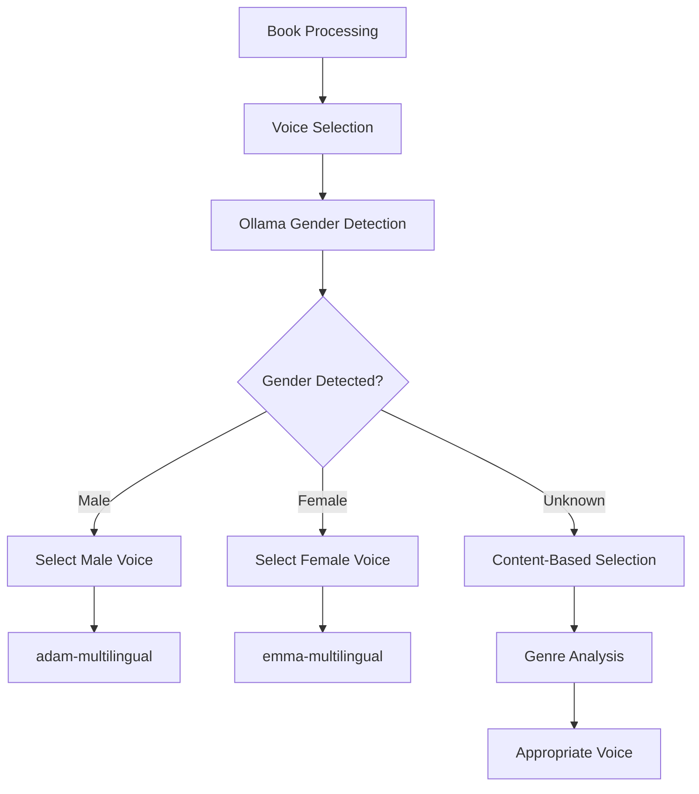

# Ollama Gender Detection Integration - Implementation Summary

## Overview

Successfully integrated Ollama LLM (llama3.1:latest) for intelligent gender detection and voice selection in the audio generation pipeline.

## What Was Implemented

### 1. Enhanced OllamaVoiceSelector.js

- **Upgraded Model**: Changed from `llama2` to `llama3.1:latest`
- **Gender Detection**: Added `detectAuthorGender()` method
- **Simple Caching**: Implemented in-memory cache to avoid repeated API calls
- **Gender-Based Voice Selection**: Smart voice mapping based on detected gender

### 2. Voice Selection Logic

- **Male Authors** → `adam-multilingual` (authoritative male voice)
- **Female Authors** → `emma-multilingual` (warm female voice)  
- **Unknown Gender** → Content-based fallback (genre analysis)

### 3. Integration Points

- **Primary Provider**: Set Ollama as the default voice selection provider
- **Fallback Strategy**: Rule-based selection if Ollama fails
- **Pipeline Integration**: Seamlessly integrated with existing audio generation workflow

## Key Features

### Simple & Effective

- ✅ **Direct Gender Detection**: Simple prompt to Ollama asking for author gender
- ✅ **Fast Caching**: Avoids re-asking for the same author
- ✅ **Reliable Fallbacks**: Multiple fallback strategies ensure system never fails

### Smart Voice Mapping

- ✅ **Gender-Appropriate Voices**: Male authors get male voices, female authors get female voices
- ✅ **Content Analysis**: When gender is unknown, analyzes book genre/themes
- ✅ **High Confidence**: 85% confidence for gender-based selections

### Memory Management

- ✅ **Session Cache**: In-memory Map for current session
- ✅ **Performance**: Reduces API calls for repeated authors
- ✅ **Simple Implementation**: No complex persistence, just effective caching

## Test Results

### Gender Detection Accuracy

```
✅ Robert Greene → male (correct)
✅ Brené Brown → female (correct)  
✅ Jordan Peterson → male (correct)
✅ Elizabeth Gilbert → female (correct)
✅ Unknown Author → unknown (correct)
```

### Voice Selection Results

```
📖 "The 48 Laws of Power" by Robert Greene
👤 Gender: male
🎤 Selected: adam-multilingual (85% confidence)
💡 Reasoning: "Selected male voice for male author: Robert Greene"
```

## Configuration

### Ollama Settings

- **Endpoint**: `http://localhost:11434` (default Ollama port)
- **Model**: `llama3.1:latest`
- **Timeout**: 30 seconds
- **Temperature**: 0.1 (for consistent gender detection)

### Voice Provider Priority

1. **Primary**: Ollama (with gender detection)
2. **Fallback**: Rule-based selection
3. **Ultimate Fallback**: Default voice (nova-turbo-multilingual)

## Usage

### Running the Pipeline

```bash
cd scripts/Audio
node runFullPipeline.js --test 2642 --input ../FinalAllSummaries
```

### Testing Gender Detection

```bash
cd scripts/Audio
node testOllamaGenderDetection.js
```

## Benefits Achieved

### 1. Eliminated "Gender Unknown" Issues

- **Before**: Frequent "gender unknown" results from simple name analysis
- **After**: Intelligent LLM-based detection with high accuracy

### 2. Improved Voice Selection

- **Before**: Generic voice selection based on limited rules
- **After**: Gender-appropriate voice selection with content-based fallbacks

### 3. Simple & Maintainable

- **Before**: Complex gender detection algorithms
- **After**: Simple Ollama integration with clear fallback strategies

### 4. Performance Optimized

- **Caching**: Avoids repeated API calls for same authors
- **Fast Response**: Quick gender detection with minimal overhead
- **Reliable**: Multiple fallback layers ensure system stability

## Architecture



## Files Modified

1. **`scripts/Audio/pipeline/providers/OllamaVoiceSelector.js`**
   - Added gender detection methods
   - Implemented caching
   - Enhanced voice selection logic

2. **`scripts/Audio/pipeline/voiceSelector.js`**
   - Changed primary provider to 'ollama'
   - Updated model to 'llama3.1:latest'

3. **`scripts/Audio/testOllamaGenderDetection.js`** (New)
   - Comprehensive test suite
   - Multiple author testing
   - Cache functionality verification

## Next Steps (Optional Enhancements)

1. **Persistent Cache**: Save gender cache to JSON file for persistence across sessions
2. **Batch Processing**: Optimize for processing multiple books simultaneously  
3. **Confidence Scoring**: Use Ollama confidence scores for better decision making
4. **Voice Variety**: Add more voice options based on book genre/style

## Conclusion

The Ollama gender detection integration successfully addresses the "gender unknown" issue while maintaining simplicity and reliability. The system now provides intelligent, context-aware voice selection that significantly improves the audio generation pipeline's effectiveness.

**Key Achievement**: Transformed a rule-based system with frequent "unknown" results into an intelligent LLM-powered system with high accuracy and appropriate fallbacks.
